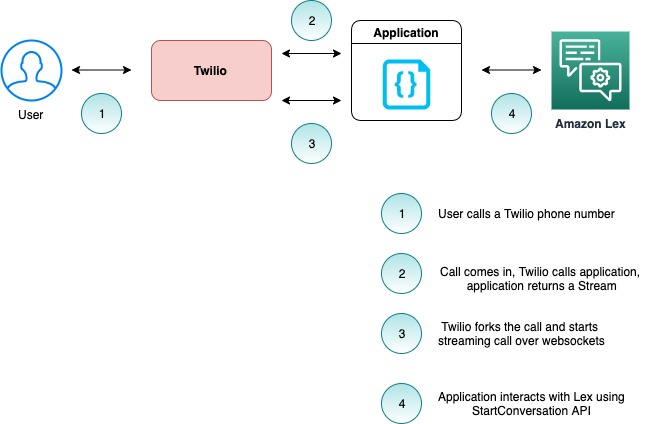
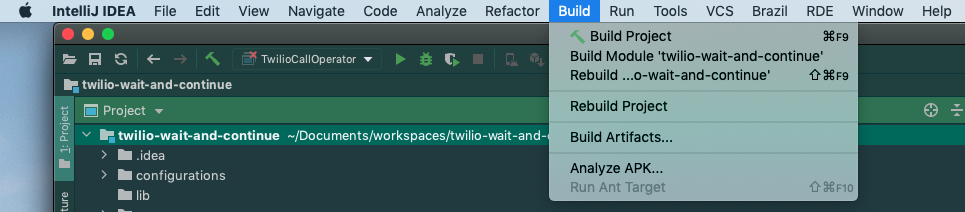
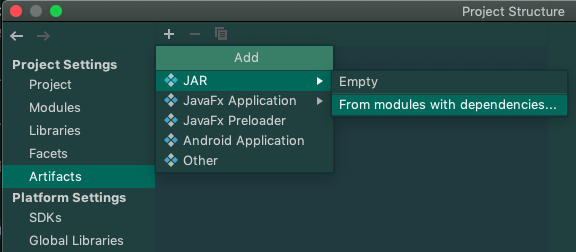
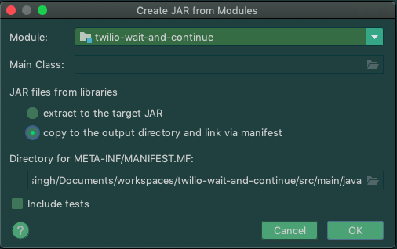
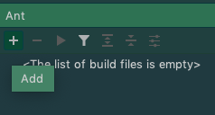
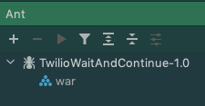
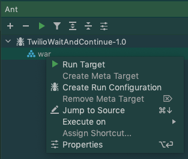

## Using a Lex bot as a conversational interface with Twilio

In this project, we will create a simple contact center solution using Lex bots. We will use Twilio to route a customer 
call to interact with a Lex bot using StartConversation API.

The following diagram captures important components and interactions between them.



For this sample application, you will 

1. Create a Lex V2 bot.
2. Configure sample application code with bot details and access credentials.
3. Host the application code on a web server.
4. Configure a Twilio phone number to invoke the application code, when user calls in.

The application automatically disconnects the ongoing call when the conversation with the bot reaches a logical end OR 
interaction with bot results in any exception.

This documentation uses [Intellij](https://www.jetbrains.com/idea/) IDE to browse, edit and build the code, but you
can use any IDE of your choice.

### Step 1 - Create a Lex V2 bot.

* Use [Amazon Lex V2 console](https://console.aws.amazon.com/lexv2) to create a bot. 
* Enable Wait and Continue behavior for a bot. Use instructions [here](https://docs.aws.amazon.com/lexv2/latest/dg/wait-and-continue.html) 
* Build the bot 
* Create an alias for the bot
* Note down the bot id and bot alias id. You will need it in next step.

### Step 2 - Configure sample application code with bot details, bot access credentials, Twilio access credentials

* Checkout the code in your local workspace using git.
* Open the project in Intellij.
    * You should use "*New->Project from existing sources*"
    * You might need to click on "*Right click on project -> Add framework support -> Maven *" for it to automatically
    pull in dependencies from Maven. For reference, the code
uses following dependencies.
        * AWS SDK
        * Twilo SDK
        * Google libraries (Gson, Guava)
        * Logging framework (Apache, Slf4j)
        * Javax Websockets API
        * Tomcat
* Configure the code with bot configuration created in [Step 1](#step-1---create-a-lex-v2-bot) above in the file. You 
will need
    * Bot Id
    * Bot Alias Id
    * Bot Locale
    * Access credentials
    * Region
```
<workspace-root>/src/main/resources/bot-configuration.properties
```
* Configure the code with Twilio configuration. These credentials are used to call Twilio API to disconnect the call
after the conversation with the bot finishes.  You will need to update the following file. You will need a Twilio account 
for this. For sign-up instructions, 
see [here](https://www.twilio.com/console)
```
<workspace-root>/src/main/resources/twilio-configuration.properties
```       
* Build the code. In Intellij, you would need to click on “*Build→Build Project*” on menu bar. 


### Step 3 - Host the application code on a web server.
In order to host the code, you will need to first convert the code into a “*WAR*” artifact.

#### Creating a WAR file

* Create a build artifact of sample application. This will copy all code, including dependencies into a single location.
In Intellij, *“Open Module Settings → Artifacts → Jar → From modules with dependencies”* and select *“copy to the output 
directory and link via Manifest”*



* Go to “*Build → Build Artifacts*”


* Update *build.xml* with location configured for artifacts path above.
```
<war destfile="${output.dir}/${ant.project.name}.war" webxml="configurations/tomcat-configuration/web.xml">
    <!-- Update this to correct artifact path -->
    <lib dir="${user.dir}/out/artifacts/twilio_wait_and_continue_jar"/>
</war>
```
* Add the *build.xml* in Ant window




* Run Ant target “war” to create a “*WAR*” file.



#### Hosting a WAR file

After you have a *WAR* file, you can host it using a Tomcat webserver. The sample application uses Docker to run the 
webserver. You will need to install [Docker](https://www.docker.com/get-started) for this.

* Run the following command from terminal. This will start the webserver and expose port 8889

```
./run-server.sh
```

* Validate you are able to hit endpoint correctly. Go to following address in your browser.  

```
http://localhost:8889/TwilioWaitAndContinue-1.0/voice
```

* You should see


#### Step 4 - Configure a Twilio phone number to invoke the application code, when user calls in.

* Get a Twilio phone number from Twilio Console. You can use the instructions [here](https://support.twilio.com/hc/en-us/articles/223135247-How-to-Search-for-and-Buy-a-Twilio-Phone-Number-from-Console).
* Configure your application code to be reached from public internet. You will need to expose port 8889 to internet. 
You can use ngrok for this. You can use the instructions on how to use ngrok [here](https://ngrok.com/). 
    * Alternatively, you can use the script packaged with the sample application to run ngrok using Docker itself.
    ```
    node run-ngrok-docker.js 8889
    ```
* Configure the Twilio phone number to invoke the public url generated above. You can use the instructions [here](https://support.twilio.com/hc/en-us/articles/223135027-Configure-a-Twilio-Phone-Number-to-Receive-and-Respond-to-Voice-Calls) 
on how to configure a Twilio phone number to invoke a webhook when a voice call comes in. 
    * You will need to append “/TwilioWaitAndContinue-1.0/voice” to the URL generated with Ngrok. E.g. URL to add in Twilio console
    ```
    https://0002113b6b40.ngrok.io/TwilioWaitAndContinue-1.0/voice
    ```
* Save the changes  


Initiate a call to the Twilio phone number from your verified phone number. Once connected, you hear the prompt 
“*Welcome to a Twilio Lex sample application.*”. After this, you will be interacting with the Amazon Lex bot that you 
created in [step 1](#step-1---create-a-lex-v2-bot)
  
## Security

See [CONTRIBUTING](CONTRIBUTING.md#security-issue-notifications) for more information.

## License

This library is licensed under the MIT-0 License. See the LICENSE file.

